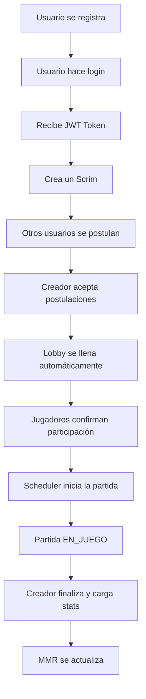

<div align="center">

# 🎮 eScrims - Plataforma de eSports

[](https://openjdk.java.net/)
[](https://spring.io/projects/spring-boot)
[](LICENSE)
[](https://github.com/brayan083/Scrims)

**Plataforma backend para la organización de scrims (partidas de práctica) en videojuegos de eSports**

[Características](#-características-principales) •
[Tecnologías](#-stack-tecnológico) •
[Instalación](#-instalación-y-ejecución) •
[API](#-documentación-de-la-api) •
[Patrones de Diseño](#-patrones-de-diseño)

</div>

---

## 📚 Contexto Académico

> **Trabajo Práctico Obligatorio Final**  
> Universidad Argentina de la Empresa (UADE)  
> Materia: **Análisis y Diseño Orientado a Objetos (ADOO)**  
> Año: 2025

### 👥 Equipo de Desarrollo

| Nombre | LU |
|--------|-----|
| Brayan Zorro | 1164xxx |
| Fabian Aranda | 1164xxx |
| Christia Soto | 1164xxx |

---

## 📖 Descripción del Proyecto

**eScrims** es una API RESTful robusta diseñada para revolucionar la organización de partidas de práctica en el mundo de los eSports. La plataforma permite a jugadores de todo el mundo crear, gestionar y participar en scrims personalizados, ofreciendo un sistema completo que abarca desde la formación de equipos hasta el análisis de estadísticas post-partida.

### 🎯 Objetivos del Proyecto

- Aplicar patrones de diseño GoF (Gang of Four) en un contexto real
- Implementar una arquitectura limpia y escalable con Spring Boot
- Desarrollar un sistema de autenticación y autorización seguro
- Gestionar estados complejos mediante máquinas de estado
- Crear un sistema de notificaciones desacoplado y extensible

---

## ✨ Características Principales

### 🔐 Autenticación y Seguridad
- **JWT (JSON Web Tokens)** para autenticación stateless
- Encriptación de contraseñas con BCrypt
- Autorización basada en roles y propietario del recurso

### 🎲 Gestión de Scrims
- **Creación personalizada** con múltiples parámetros (juego, formato, región, rango)
- **Sistema de postulaciones** con aceptación/rechazo manual
- **Lobby automático** que se arma al completar equipos
- **Inicio programado** de partidas con scheduler automático
- **Cancelación** con notificación a participantes

### 📊 Sistema de Rankings
- **MMR Dinámico** (Matchmaking Rating) que se actualiza tras cada partida
- Sistema de **ganancia/pérdida de puntos** basado en resultado
- Promoción de **matchmaking equilibrado** entre jugadores

### 📈 Estadísticas Detalladas
- Registro de **KDA** (Kills/Deaths/Assists) por jugador
- Elección de **MVP** de la partida
- Historial completo de partidas jugadas

### 🔔 Sistema de Notificaciones
- **Event-driven architecture** con Spring Events
- Notificaciones en tiempo real para:
  - Lobby completo
  - Confirmaciones pendientes
  - Inicio de partida
  - Cambios de estado del scrim

---

## 🛠️ Stack Tecnológico

### Backend Framework
- **Spring Boot 3.5.7** - Framework principal
- **Spring Web** - REST API
- **Spring Data JPA** - Capa de persistencia
- **Spring Security** - Seguridad y autenticación

### Base de Datos
- **H2 Database** - Base de datos en memoria (desarrollo)
- **MySQL** - Base de datos para producción (configuración comentada)
- **Hibernate** - ORM (Object-Relational Mapping)

### Autenticación
- **JWT (io.jsonwebtoken)** v0.10.7 - Tokens de autenticación
- **BCrypt** - Hashing de contraseñas

### Herramientas de Desarrollo
- **Lombok** - Reducción de boilerplate
- **Maven** - Gestión de dependencias
- **JUnit 5** - Testing unitario
- **Mockito** - Mocking para tests
- **MockMvc** - Testing de controladores

### Java
- **Java 17** (LTS) - Lenguaje de programación

---

## 📐 Patrones de Diseño

Este proyecto implementa múltiples patrones de diseño GoF para garantizar código limpio, desacoplado y mantenible:

### 1️⃣ State Pattern
**Ubicación:** `com.uade.tpo.Scrims.model.patterns.state`

Gestiona el ciclo de vida complejo de un Scrim a través de estados bien definidos:

```
BUSCANDO_JUGADORES → LOBBY_ARMADO → CONFIRMADO → EN_JUEGO → FINALIZADO
                                                      ↓
                                                  CANCELADO
```

**Ventajas:**
- Encapsula comportamiento específico en cada estado
- Facilita la adición de nuevos estados
- Elimina condicionales complejos

### 2️⃣ Observer Pattern
**Ubicación:** `com.uade.tpo.Scrims.config.EventBusConfig`

Implementado mediante **Spring Events** para notificaciones desacopladas:
- `ScrimStateChangedEvent` - Cambios de estado
- `LobbyCompleteEvent` - Lobby lleno
- Suscriptores reaccionan automáticamente a eventos

**Ventajas:**
- Desacoplamiento entre publicadores y suscriptores
- Extensibilidad sin modificar código existente

### 3️⃣ Abstract Factory Pattern
**Ubicación:** `com.uade.tpo.Scrims.model.patterns.factory`

Crea familias de objetos relacionados (notificadores):
- `DevNotifierFactory` - Familia de notificadores para desarrollo
- Permite agregar `EmailNotifierFactory`, `PushNotifierFactory`, etc.

**Ventajas:**
- Consistencia entre productos de una misma familia
- Cambio fácil entre familias completas

### 4️⃣ Adapter Pattern
**Ubicación:** `com.uade.tpo.Scrims.model.patterns.observer`

Adapta diferentes implementaciones a una interfaz común:
- `ConsoleLoggerNotifier` - Adapter para System.out
- Interfaz `Notifier` unifica diferentes sistemas de notificación

### 5️⃣ Facade Pattern
**Ubicación:** `com.uade.tpo.Scrims.model.service.ScrimFacade`

Simplifica la interacción con subsistemas complejos:
- Orquesta operaciones entre `ScrimService`, `TeamManagementService`, `StatisticsService`
- Proporciona una API simplificada al controlador

### 6️⃣ Command Pattern
**Ubicación:** `com.uade.tpo.Scrims.model.patterns.command`

Encapsula operaciones como objetos:
- `AcceptPlayerCommand` - Aceptar jugador
- `RejectPlayerCommand` - Rechazar jugador
- Permite undo/redo y logging de acciones

### 7️⃣ Strategy Pattern
**Ubicación:** `com.uade.tpo.Scrims.model.patterns.strategy`

Define familia de algoritmos intercambiables:
- `WinnerRankingStrategy` - Cálculo de MMR para ganadores
- `LoserRankingStrategy` - Cálculo de MMR para perdedores
- Permite cambiar algoritmo de ranking sin modificar código cliente

### 8️⃣ MVC (Model-View-Controller)
**Arquitectura general:**
- **Model:** Entidades de dominio y servicios
- **View:** DTOs (Data Transfer Objects)
- **Controller:** Endpoints REST

---

## 🚀 Instalación y Ejecución

### 📋 Requisitos Previos

Asegúrate de tener instalado:
- **Java JDK 17** o superior ([Descargar aquí](https://adoptium.net/))
- **Maven 3.6+** ([Descargar aquí](https://maven.apache.org/download.cgi))
- **Git** (opcional, para clonar el repositorio)

### 📥 Clonar el Repositorio

```bash
git clone https://github.com/brayan083/Scrims.git
cd Scrims
```

### ▶️ Ejecución con Maven

#### Opción 1: Maven Wrapper (Recomendado)
```bash
# Windows
.\mvnw.cmd spring-boot:run

# Linux/Mac
./mvnw spring-boot:run
```

#### Opción 2: Maven Instalado
```bash
mvn spring-boot:run
```

### ✅ Verificación

El servidor estará disponible en:
```
http://localhost:8080
```

Deberías ver en la consola:
```
Started ScrimsApplication in X.XXX seconds
```

---

## 🗄️ Base de Datos

### H2 Console (Desarrollo)

Accede a la consola web de H2 para inspeccionar la base de datos en tiempo real:

- **URL:** http://localhost:8080/h2-console
- **JDBC URL:** `jdbc:h2:mem:escrimsdb`
- **Username:** `sa`
- **Password:** `password`

### MySQL (Producción)

Para usar MySQL, descomenta la configuración en `application.properties` y ajusta las credenciales:

```properties
spring.datasource.url=jdbc:mysql://localhost:3306/escrimsdb
spring.datasource.username=root
spring.datasource.password=tu_password
spring.jpa.database-platform=org.hibernate.dialect.MySQLDialect
```

---

## 🧪 Testing

### Ejecutar Tests
```bash
# Con Maven Wrapper
.\mvnw.cmd test

# Con Maven
mvn test
```

### Cobertura de Tests
El proyecto incluye:
- ✅ **Tests de integración** (`ScrimIntegrationTest`)
- ✅ **Tests unitarios** de servicios
- ✅ **Tests de estados** (`BuscandoJugadoresStateTest`)
- ✅ **Tests de patrones** (`DevNotifierFactoryTest`)

---

## 📡 Documentación de la API

### 🔓 Endpoints Públicos

#### Registro de Usuario
```http
POST /api/auth/register
Content-Type: application/json

{
  "username": "jugador123",
  "email": "jugador@email.com",
  "password": "password123",
  "region": "LAS"
}
```

#### Login
```http
POST /api/auth/login
Content-Type: application/json

{
  "username": "jugador123",
  "password": "password123"
}
```

**Respuesta:**
```json
{
  "token": "eyJhbGciOiJIUzI1NiIsInR5cCI6IkpXVCJ9...",
  "username": "jugador123"
}
```

---

### 🔐 Endpoints Protegidos

> **Nota:** Todos los endpoints siguientes requieren el header:  
> `Authorization: Bearer {token}`

#### Crear Scrim
```http
POST /api/scrims
Content-Type: application/json
Authorization: Bearer {token}

{
  "gameName": "League of Legends",
  "format": "5v5",
  "region": "LAS",
  "minimumRank": 1500,
  "scheduledDateTime": "2025-11-15T20:00:00"
}
```

#### Listar Scrims Disponibles
```http
GET /api/scrims
Authorization: Bearer {token}
```

#### Postularse a un Scrim
```http
POST /api/scrims/{scrimId}/postulations
Authorization: Bearer {token}
```

#### Aceptar Postulación (Solo Creador)
```http
POST /api/scrims/{scrimId}/postulations/{postulationId}/accept
Authorization: Bearer {token}
```

#### Rechazar Postulación (Solo Creador)
```http
POST /api/scrims/{scrimId}/postulations/{postulationId}/reject
Authorization: Bearer {token}
```

#### Confirmar Participación
```http
POST /api/scrims/{scrimId}/confirmations
Authorization: Bearer {token}
```

#### Finalizar Scrim y Cargar Estadísticas (Solo Creador)
```http
POST /api/scrims/{scrimId}/finalize
Content-Type: application/json
Authorization: Bearer {token}

{
  "winnerTeamId": 1,
  "mvpUserId": 5,
  "playerStats": [
    {
      "userId": 5,
      "kills": 10,
      "deaths": 2,
      "assists": 15
    }
  ]
}
```

#### Cancelar Scrim (Solo Creador)
```http
POST /api/scrims/{scrimId}/cancelar
Authorization: Bearer {token}
```

#### Ver Estadísticas de Scrim Finalizado
```http
GET /api/scrims/{scrimId}/estadisticas
Authorization: Bearer {token}
```

---

## 📊 Flujo de Uso Típico



---

## 🏗️ Arquitectura del Proyecto

```
src/main/java/com/uade/tpo/Scrims/
├── config/                      # Configuraciones de Spring
│   ├── SecurityConfig.java      # Configuración de seguridad
│   ├── JwtAuthFilter.java       # Filtro de autenticación JWT
│   ├── EventBusConfig.java      # Configuración de eventos
│   └── GlobalExceptionHandler.java
├── controller/                  # Controladores REST
│   ├── AuthController.java      # Endpoints de autenticación
│   └── ScrimController.java     # Endpoints de scrims
├── model/
│   ├── domain/                  # Entidades del dominio
│   │   ├── User.java
│   │   ├── Scrim.java
│   │   ├── Team.java
│   │   ├── Postulation.java
│   │   ├── Confirmation.java
│   │   └── ScrimStatistics.java
│   ├── infrastructure/          # Repositorios JPA
│   │   └── persistence/
│   ├── patterns/                # Implementación de patrones
│   │   ├── state/              # State Pattern
│   │   ├── observer/           # Observer Pattern
│   │   ├── factory/            # Abstract Factory
│   │   ├── command/            # Command Pattern
│   │   └── strategy/           # Strategy Pattern
│   └── service/                # Servicios de negocio
│       ├── ScrimService.java
│       ├── ScrimFacade.java
│       ├── UserService.java
│       ├── TeamManagementService.java
│       ├── StatisticsService.java
│       └── ScrimScheduler.java
└── view/                       # Capa de presentación
    ├── dto/                    # Data Transfer Objects
    │   ├── request/
    │   └── response/
    └── mapper/                 # Mappers DTO ↔ Entity
```

---
---

## 📄 Licencia

Este proyecto está bajo la Licencia MIT. Ver el archivo `LICENSE` para más detalles.

---

## 📞 Contacto

**Equipo de Desarrollo:**
- Brayan Zorro - [GitHub](https://github.com/brayan083)
- Fabian Aranda
- Christia Soto

**Institución:**  
Universidad Argentina de la Empresa (UADE)

---

<div align="center">

**⭐ Si te gustó este proyecto, no olvides darle una estrella ⭐**

Hecho con ❤️ por el equipo de eScrims

</div>